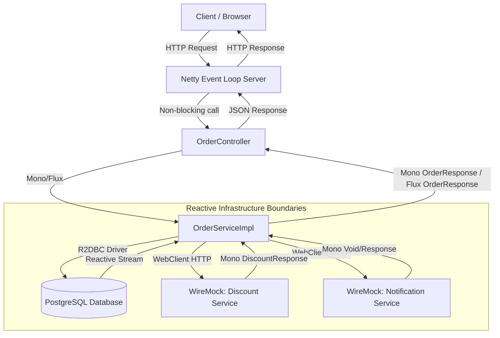

# Learning Plan for Building a Reactive Application with Spring WebFlux

---

## 1. Learning Objective

The primary objective of this project is the **practical mastery of fundamental reactive and non-blocking programming principles** within the Java / Spring ecosystem.

Upon completing this plan, the developer will learn to:
* Build non-blocking REST APIs using **Spring WebFlux**.
* Work with reactive types **`Mono`** (0..1 element) and **`Flux`** (0..N elements) from Project Reactor.
* Implement non-blocking database interaction with PostgreSQL using **Spring Data R2DBC**.
* Execute asynchronous non-blocking HTTP requests to external microservices via **Spring WebClient**.
* Configure an integration environment using **Docker Compose** (PostgreSQL + WireMock).
* Handle errors gracefully in reactive chains without interrupting data streams.
* Detect and prevent blocking operations in the Event Loop using **BlockHound**.
* Write robust unit and integration tests using `StepVerifier`, `WebTestClient`, `WireMock`, and `Testcontainers`.

---

## 2. Domain & Application Architecture

### Domain: `Order Processing Service`

An e-commerce order processing service was chosen for educational purposes. The application performs the following functions:
1. Accepts order creation requests from clients.
2. Persists orders and order items in PostgreSQL via **R2DBC**.
3. Calls an external discount/promo code service (stubbed via **WireMock**) to calculate total pricing.
4. Dispatches order creation notifications (also stubbed via **WireMock**).
5. Exposes reactive CRUD endpoints for retrieving orders (streaming via `Flux` / Server-Sent Events) and specific order details (`Mono`).

### Reactive Data Flow
1. **Request Phase**: The request hits a Netty Event Loop thread.
2. **Execution Phase**: The request is routed to `OrderController` -> `OrderService` without blocking threads.
3. **External Calls**: `OrderService` asynchronously executes non-blocking R2DBC queries to PostgreSQL and HTTP requests to WireMock via `WebClient` concurrently or sequentially using `flatMap`/`zip`.
4. **Response Phase**: Once data is ready, Netty returns the HTTP response. The Event Loop thread remains unblocked throughout I/O waits.

### Architecture & Interaction Diagram



---

## 3. Technology Stack

| Component | Technology / Library | Purpose |
| :--- | :--- | :--- |
| **Language & JDK** | Java 25 | Programming Language |
| **Framework** | Spring Boot 4.x | Core Application Framework |
| **Web Layer** | Spring WebFlux (Project Reactor / Netty) | Reactive Web Server & REST API |
| **Database** | PostgreSQL 18 | Relational Database |
| **Reactive Data Access** | Spring Data R2DBC (`r2dbc-postgresql`) | Non-blocking DB Access |
| **Database Migrations** | Flyway (`flyway-core`, `flyway-database-postgresql`) | Automatic DB Schema Migrations |
| **HTTP Client** | Spring WebClient | Non-blocking Reactive HTTP Client |
| **Mocking External APIs** | WireMock (Docker Container) | Stubbing External Services |
| **Containerization** | Docker & Docker Compose | Infrastructure Environment |
| **Validation** | Jakarta Bean Validation (`spring-boot-starter-validation`) | Reactive DTO Validation |
| **Testing** | JUnit 5, Reactor Test (`StepVerifier`), WebTestClient, Testcontainers, BlockHound | Comprehensive Reactive Testing |

---

## 4. Complete Project Directory Structure

```text
ExsampleSpringWebFlux/
├── Plan.md                                 # Master Learning Plan
├── Dockerfile                              # Multi-stage OCI Docker build
├── docker-compose.yml                      # Docker infrastructure (PostgreSQL + WireMock + Service)
├── pom.xml                                 # Maven dependencies & build configuration
├── wiremock/
│   └── mappings/
│       ├── discount-service.json           # WireMock mock mapping for discounts
│       └── notification-service.json       # WireMock mock mapping for notifications
└── src/
    ├── main/
    │   ├── java/
    │   │   └── com/
    │   │       └── example/
    │   │           └── webflux/
    │   │               ├── WebFluxApplication.java              # Main Application Class & BlockHound init
    │   │               ├── config/
    │   │               │   ├── R2dbcConfig.java                 # R2DBC & Database Converters config
    │   │               │   ├── WebClientConfig.java             # WebClient beans configuration
    │   │               │   └── SwaggerConfig.java               # OpenAPI / Swagger UI config
    │   │               ├── domain/
    │   │               │   ├── entity/
    │   │               │   │   ├── Order.java                   # Order R2DBC Entity
    │   │               │   │   └── OrderItem.java               # OrderItem R2DBC Entity
    │   │               │   └── enums/
    │   │               │       └── OrderStatus.java             # Order Status Enum
    │   │               ├── dto/
    │   │               │   ├── request/
    │   │               │   │   ├── CreateOrderRequest.java      # Order Creation Request DTO
    │   │               │   │   └── CreateOrderItemRequest.java  # Order Item Request DTO
    │   │               │   ├── response/
    │   │               │   │   ├── OrderResponse.java          # Order Response DTO
    │   │               │   │   ├── OrderItemResponse.java      # Order Item Response DTO
    │   │               │   │   ├── DiscountResponse.java       # Discount Response DTO
    │   │               │   │   ├── NotificationResponse.java   # Notification Response DTO
    │   │               │   │   └── OrderAnalyticsResponse.java # Aggregated Analytics DTO
    │   │               │   └── internal/
    │   │               │       └── DiscountCalculation.java    # Internal Calculation record
    │   │               ├── repository/
    │   │               │   ├── OrderRepository.java             # Reactive Order R2DBC Repository
    │   │               │   └── OrderItemRepository.java         # Reactive OrderItem R2DBC Repository
    │   │               ├── service/
    │   │               │   ├── OrderService.java                # Order Service Interface
    │   │               │   └── OrderServiceImpl.java            # Reactive Service Implementation
    │   │               ├── client/
    │   │               │   ├── ExternalDiscountClient.java      # WebClient for Discount Service
    │   │               │   └── ExternalNotificationClient.java  # WebClient for Notification Service
    │   │               ├── exception/
    │   │               │   ├── OrderNotFoundException.java      # Custom 404 Exception
    │   │               │   ├── ExternalServiceException.java    # Custom 502 Exception
    │   │               │   └── GlobalExceptionHandler.java      # @RestControllerAdvice for WebFlux
    │   │               └── mapper/
    │   │                   └── OrderMapper.java                 # Entity <-> DTO Component Mapper
    │   └── resources/
    │       ├── application.yml                                  # Spring Boot Application Properties
    │       └── db/
    │           └── migration/
    │               └── V1__init_schema.sql                      # Flyway DDL Schema Script
    └── test/
        └── java/
            └── com/
                └── example/
                    └── webflux/
                        ├── BlockHoundTest.java                  # BlockHound blocking call test
                        ├── client/
                        │   └── ExternalDiscountClientTest.java  # WebClient + WireMock Integration Test
                        ├── controller/
                        │   └── OrderControllerTest.java         # WebTestClient Controller Test
                        ├── dto/
                        │   └── request/
                        │       └── CreateOrderRequestValidationTest.java # Validation Tests
                        ├── exception/
                        │   └── GlobalExceptionHandlerTest.java # Exception Handler Tests
                        ├── repository/
                        │   ├── OrderRepositoryTest.java        # Repository Unit Test
                        │   └── OrderRepositoryIT.java          # Testcontainers R2DBC Integration Test
                        └── service/
                            └── OrderServiceTest.java           # StepVerifier Reactive Service Unit Tests
```

---

## 5. Sequential Step-by-Step Implementation Roadmap

### Step 1. Project Initialization & Dependency Setup
* **Created Component:** `pom.xml`.
* **Purpose:** Configuring project build dependencies.
* **Problem Solved:** Includes Spring Boot WebFlux, R2DBC, PostgreSQL, Flyway, Resilience4j, OpenAPI, Testcontainers, WireMock, and BlockHound.

---

### Step 2. Docker Compose Infrastructure Setup (PostgreSQL + WireMock)
* **Created Component:** `docker-compose.yml`, `wiremock/mappings/*.json`.
* **Purpose:** Setting up local integration testing infrastructure.
* **Problem Solved:** Provides real PostgreSQL 18 and stubbed external microservices without manual configuration.

---

### Step 3. Flyway SQL Schema Migrations
* **Created Component:** `V1__init_schema.sql`.
* **Purpose:** Creating relational database schema for orders and items.
* **Problem Solved:** Versioning database schema and enabling automatic migrations at startup.

---

### Step 4. Reactive Domain Entities & Enums
* **Created Component:** `Order.java`, `OrderItem.java`, `OrderStatus.java`.
* **Purpose:** Representing Spring Data R2DBC domain models.
* **Problem Solved:** Mapping database tables to Java objects using `@Table` and `@Id` annotations.

---

### Step 5. Spring Data R2DBC Repositories
* **Created Component:** `OrderRepository.java`, `OrderItemRepository.java`.
* **Purpose:** Non-blocking data access layer interfaces extending `ReactiveCrudRepository`.
* **Problem Solved:** Executing non-blocking CRUD and custom Reactive SQL queries.

---

### Step 6. DTOs and Request Validation Models
* **Created Component:** Request/Response DTOs in `com.example.webflux.dto`.
* **Purpose:** Decoupling API contracts from database entities.
* **Problem Solved:** Validating incoming payloads with Jakarta Validation annotations (`@NotBlank`, `@NotNull`, `@Size`).

---

### Step 7. R2DBC & Custom Converters Configuration
* **Created Component:** `R2dbcConfig.java`.
* **Purpose:** Configuring R2DBC connection factory and custom data converters.
* **Problem Solved:** Ensuring clean enum conversion between Java and PostgreSQL.

---

### Step 8. WebClient Integrations for External Microservices
* **Created Component:** `WebClientConfig.java`, `ExternalDiscountClient.java`, `ExternalNotificationClient.java`.
* **Purpose:** Asynchronous HTTP integration with external discount and notification services.
* **Problem Solved:** Non-blocking external HTTP calls using `WebClient`.

---

### Step 9. Business Logic & Reactive Service Layer
* **Created Component:** `OrderService.java`, `OrderServiceImpl.java`, `OrderMapper.java`.
* **Purpose:** Orchestrating order creation, pricing calculations, DB persistence, and notifications.
* **Problem Solved:** Reactive flow composition using `Mono`, `Flux`, `flatMap`, and error recovery mechanisms.

---

### Step 10. Request Validation in Reactive Streams
* **Created Component:** `CreateOrderRequestValidationTest.java`.
* **Purpose:** Validating incoming payload constraint rules.
* **Problem Solved:** Ensuring boundary validation for incoming HTTP payloads.

---

### Step 11. Reactive Web Layer & Controller Layer
* **Created Component:** `OrderController.java`.
* **Purpose:** Exposing non-blocking REST endpoints and Server-Sent Events (SSE).
* **Problem Solved:** Handling HTTP requests asynchronously over Netty.

---

### Step 12. Reactive Exception Handling (`@RestControllerAdvice`)
* **Created Component:** `GlobalExceptionHandler.java`, `OrderNotFoundException.java`, `ExternalServiceException.java`.
* **Purpose:** Centralized reactive exception mapping to HTTP status codes.
* **Problem Solved:** Returning clean `ProblemDetail` / JSON error responses for WebFlux exceptions.

---

### Step 13. Resilience4j & Reactive Error Recovery
* **Created Component:** Resilience logic in `ExternalDiscountClient.java` and `OrderServiceImpl.java`.
* **Purpose:** Guarding external calls with `timeout`, `retryWhen` backoff, and `onErrorResume` fallbacks.
* **Problem Solved:** Preventing cascade failures when external services fail.

---

### Step 14. Complex Reactor Operators (`Mono.zip`)
* **Created Component:** `getOrderAnalytics()` endpoint in `OrderService` and `OrderController`.
* **Purpose:** Executing concurrent independent asynchronous queries.
* **Problem Solved:** Combining `count()` and `findAll()` results asynchronously into `OrderAnalyticsResponse`.

---

### Step 15. Non-Blocking Audit with BlockHound
* **Created Component:** `BlockHound.install()` in `WebFluxApplication.java` & `BlockHoundTest.java`.
* **Purpose:** Automated detection of blocking calls in Event Loop threads.
* **Problem Solved:** Guaranteeing zero blocking calls (`Thread.sleep`, blocking I/O) in non-blocking threads.

---

### Step 16. Unit Testing with `StepVerifier`
* **Created Component:** `OrderServiceTest.java`.
* **Purpose:** Isolated reactive unit testing.
* **Problem Solved:** Asserting asynchronous signals (`onNext`, `onError`, `onComplete`) with virtual time assertions.

---

### Step 17. Web Layer Integration Testing with `WebTestClient`
* **Created Component:** `OrderControllerTest.java`.
* **Purpose:** Integration testing of REST endpoints, JSON serialization, and status codes.
* **Problem Solved:** Non-blocking HTTP web layer verification using `WebTestClient`.

---

### Step 18. Integration Testing with WireMock
* **Created Component:** `ExternalDiscountClientTest.java`.
* **Purpose:** Testing WebClient HTTP interactions against WireMock stubs.
* **Problem Solved:** Verifying 200, 404, and 500 status handling for external HTTP calls.

---

### Step 19. PostgreSQL Integration Testing with Testcontainers & R2DBC
* **Created Component:** `OrderRepositoryIT.java`.
* **Purpose:** Integration testing against a real PostgreSQL container.
* **Problem Solved:** Verifying R2DBC queries and Flyway schema execution in an isolated PostgreSQL container.

---

### Step 20. Multi-Stage Dockerfile Setup
* **Created Component:** `Dockerfile`.
* **Purpose:** Multi-stage OCI image build.
* **Problem Solved:** Producing minimal, secure runtime images without build source dependencies.

---

### Step 21. End-to-End System Execution with Docker Compose
* **Created Component:** Updated `docker-compose.yml`.
* **Purpose:** End-to-End verification of the entire reactive system.
* **Problem Solved:** Verifying full communication between WebFlux, R2DBC, PostgreSQL, and WireMock in Docker containers.

---

## 6. Definition of Done (DoD)

The project is considered complete when:

1. [x] **All Planned Components Implemented**: All classes matching Section 4 structure are created and passing tests.
2. [x] **Non-Blocking Endpoints**: Zero `.block()`, `RestTemplate`, or JDBC calls exist in production code.
3. [x] **BlockHound Verified**: Tests confirm zero accidental blocking calls in Event Loop threads.
4. [x] **R2DBC Persistence**: Database interactions execute exclusively via Spring Data R2DBC.
5. [x] **Flyway Migrations**: Relational schema migrates automatically on application startup.
6. [x] **WebClient Resilience**: External HTTP calls handle timeouts, retries, and fallbacks cleanly.
